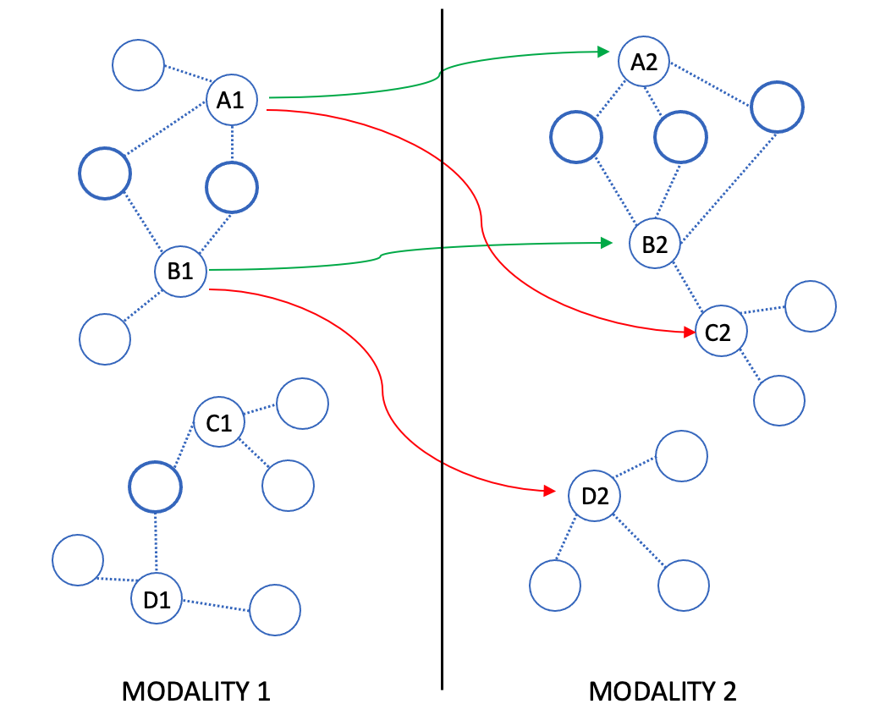

# synmatch
## Linking cells across single-cell modalities by synergistic matching of neighborhood structure

Synmatch finds direct matching of cells between different measurements by exploiting information about neighborhood structure in each modality. It takes as input two matrices of single-cell profiles measuring different cellular properties, such as gene expression and chromatin accessibility, and outputs a matching of the cells across the datasets. 

### Learn more
The key idea behind Synmatch is that the same cell, when measured in two different modalities, is likely to have similar sets of neighboring cells in the two spaces. We use this intuition to formulate the matching problem as a supermodular optimization over the neighborhood structure of the two modalities, and we solve the problem using a fast greedy heuristic. Note that the two modalities need not share any features, Synmatch operates in an entirely unsupervised manner.

You can find more about the theory behind Synmatch by reading our [paper](https://www.biorxiv.org/content/10.1101/2022.04.20.488794v1.full.pdf). If you use Synmatch in an academic setting please cite us.

### Dependencies
Synmatch is implemented in Python and uses Docker as well as the common numpy, sklearn, and scipy packages.
Note that Synmatch relies on Coopraiz, an ultra-fast software for submodular optimizations developed by Jeff Bilmes at [smr.ai](https://smr.ai/), which is included as a Docker container. Therefore, please make sure you have Docker installed and running prior to running Synmatch.

### How to run
Simply provide the two different cell measurements as .npy matrices where each row corresponds to a cell and each column to a feature:

\%> python bin/synmatch.py data/example\_RNA.npy data/example\_ATAC.npy outputfile.txt

### Questions
Feel free to email Borislav Hristov: borislav at uw.edu 
